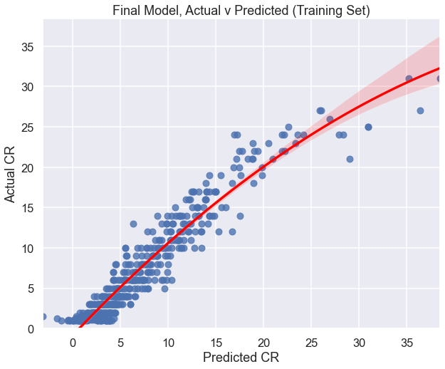

# DnD Challenge Rating Prediction

Authors: Jocelyn Fisher

## Overview
This project uses an iterative approach to Regression Modelling in order to understand how a Home-brew Dungeon & Dragons Monster stats may effect its Challenge Rating (CR). With increasing popularity surrounding the Tabletop RPG, D&D Beyond can use this Prediction Model to calculate the CR of any Home-brew Monster while successfully accounting for the variance of 91% of the model. Once implemented into their Website, can provide a CR Calculation/Prediction tool for the increasing player base.

## Business Problem
[D&D Beyond](https://www.dndbeyond.com) is one of the most popular online Dungeon and Dragons platforms for players all over the world. It has hundreds of pages of information on the Tabletop Game and it's rules, as well as many Tools for players to use, such as;

- Creating a character,
- Organising a campaign,
- Designing character made (or Home-brew) Monsters.

In order to complete a Home-brew Monster, the tool requires the player to input it's Challenge Rating (referred to as CR), which is a number indication of how difficult the Monster may be to defeat. However, there is no tool within D&D Beyond itself to do this, and online research finds that the calculation of CR is quite a mystifying problem, especially for people that are new to the game.

With increasing popularity over the past 5 years, and a new D&D movie on the horizon, a wave of new players may be on the way. Therefore, it is of D&D Beyond's benefit to produce a CR calculator that can be implemented into the website in preparation for this influx. This project aims to provide such a tool that can use the stats of any Home-brew Monster, and output a CR that is appropriate and suitable, based upon a prediction model using Official Monster stats and how they correlate with their CR.

## The Data
The data sourced for this regression analysis comes from [Kaggle](https://www.kaggle.com/datasets/travistyler/dnd-5e-monster-manual-stats), which has been API scraped from an online version of the Official 5th Edition Dungeon & Dragons Compendium available at [AideDD](https://www.aidedd.org/dnd-filters/monsters.php).

This data-set includes 762 different D&D Monsters, with 53 columns on their details. It provided insight into not only their base stats such as Health Points (HP) and Armour Class (AC), but also information on their Action and Attack abilities. Thankfully, as D&D is a maths and number based tabletop RPG, many of the desired columns were already integers which is appropriate for regression analysis.

The data-set used for this project can be found in the [here](data/aidedd_blocks2.csv), in the data folder of this repository.

## Method
This project used an iterative approach to regression analysis to provide an insightful overview into the Challenge Rating of official D&D Monsters, in order to construct an accurate prediction and calculation model, as well as provide inference into the most correlated stats.

Through various visualisations and Linear Regression Analysis, the project went through six total iterations, including the simple base model. These versions tackled issues including identifying and transforming the categorical data of `size` and `type`, into ordinal and linear types, as well as experimenting with normalisation of skewed data, however the latter was not implemented as it effected the models ability to account for variability.

## Results
This regression analysis can successfully account for the variance of 91% of the model.

The final model was showing a better fit of Actual vs Predicted CR values, with a slight curve in the higher Challenge Ratings.


Using an inbuilt method, the model was able to provide inference upon what variable were most correated with cr as well.

The top 10 were:

1) hp
2) intel
3) cha
4) ac
5) wis
6) strength
7) con
8) dex
9) multiattack
10) type_fiend

### Prediction

Finally, using the stats of a Home-brew Monster created on the D&D Beyond tool, the model was able to then predict and therefore calculate what it's CR should be.

Originally, this Home-brew Monster was created from a template of an existing official Monster, which is something that you can choose to do on D&D Beyond. Many of it's characteristics were altered, and therefore the CR was also adjusted to what was thought to be an appropriate level of 10.


The Challenge Rating for this Monster was found to be 14, which was 4 levels higher than initially thought without this calculation/prediction model.

## Conclusions
Based off this regression analysis, D&D Beyond may use this prediction model to implement a Challenge Rating Calculator for their Monster Creation Tool, and make it available to the online platform players.  

- Many have anecdotally claimed that "CR is measured only by ac and hp", and although these claims have some merit showcased within this analysis, `ac` interestingly does not have as much importance to the model as previously thought.
- The `fiend` Monster type has been shown to be the species of creature that is most correlated with CR. More analysis into reasons behind this may provide a more sophisticated understanding of why, such as whether they are particular to having multiattacks or higher stats than most other Monster types.
- Further collated information on Monster Resistances and Immunities, which was not provided in the data sourced, could extrapolate on possible missing inferences into what dictates CR.
- As more official Dungeon & Dragons Monsters are released through game expansions, they can also be included upon the model's data-set to improve the Challenge Rating predictions.

## For More Information
Please review our full analysis in the notebooks found in the [Code Folder](code/) and the Presentation pdf.

For any additional questions, please contact **Jocelyn Fisher** at **[jocelynclaire216@gmail.com](mailto:jocelynclaire216@gmail.com)**

## Repository Structure
```
├── code
│   ├── Cleaning & Exploration.ipynb
│   └── Regression Modelling.ipynb
├── data
│   ├── aidedd_blocks2.csv
│   └── Final_Monster_Data.csv
├── images
├── DnD Challenge Rating Prediction Notebook.ipynb
├── DnD Challenge Rating Prediction Presentation.pdf
├── Glossary.md
└── README.md
```
